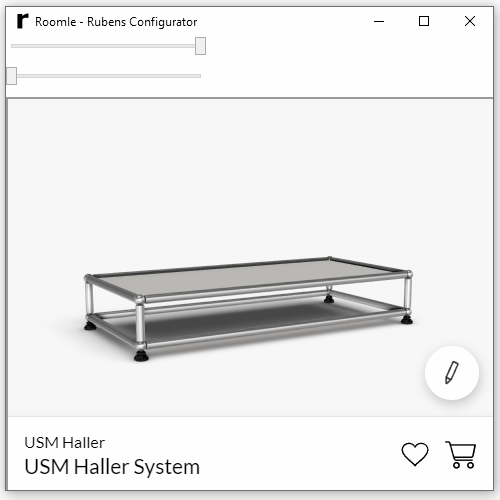

# Configurator in WPF WebView

## Roomel SDK

[Roomle - Embedding Integration](https://docs.roomle.com/web/embedding/#getting-started)

Get sdk ([@roomle/embedding-lib](https://www.npmjs.com/package/@roomle/embedding-lib)):

```lang-none
npm i @roomle/embedding-lib
```

## WebView resources

- [WebView2 sample code](https://docs.microsoft.com/en-us/microsoft-edge/webview2/code-samples-links)  
- [MicrosoftEdge/WebView2Samples](https://github.com/MicrosoftEdge/WebView2Samples)

## Step by step

1. Create a WPF dialog with a WebView2 control. See [Get started with WebView2 in WPF apps](https://docs.microsoft.com/en-us/microsoft-edge/webview2/get-started/wpf)

2. Create a resource folder for the web content and add _roomle-configurator-api.es.min.js_. The files can be found here: [Roomle Rubens Configurator Embedding Lib](https://www.npmjs.com/package/@roomle/embedding-lib).  
   (In the example the name of the folder is _resource\wwwroot_) 

3. Get the quick start _html_ from here: [Embedding Integration - Copy & Paste without package manager](https://docs.roomle.com/web/embedding/#copy-paste-without-package-manager).  
   Create an _index.html_ file in the resource folder and paste the content from the quick start guide.

4. Establish a mapping between a virtual host name and the path of the web resources folder. Set the source of the web view by the local host:

    ```c#
    async private Task InitializeAsync(WebView2 webView)
    {
        string hostName = "rubens.example"
        string localResourcePath = Path.Join(AppDomain.CurrentDomain.BaseDirectory, @"resource\wwwroot");

        await webView.EnsureCoreWebView2Async();
        webView.CoreWebView2.SetVirtualHostNameToFolderMapping(
            hostName, localResourcePath, CoreWebView2HostResourceAccessKind.DenyCors);
        webView.Source = new Uri($"https://{hostName}/index.html");
    }
    ```

    [EnsureCoreWebView2Async](https://docs.microsoft.com/en-us/dotnet/api/microsoft.web.webview2.wpf.webview2.ensurecorewebview2async?view=webview2-dotnet-1.0.1056-prerelease) wait for `CoreWebView2` initialization. The method explicitly triggers initialization of the control's CoreWebView2.  
    [SetVirtualHostNameToFolderMapping]( https://docs.microsoft.com/en-us/dotnet/api/microsoft.web.webview2.core.corewebview2.setvirtualhostnametofoldermapping?view=webview2-dotnet-1.0.1056-prerelease) sets a mapping between a virtual host name and a folder path to make available to web sites via that host name.

5. Add an event listener to the host app. In the following example, _width_ and _height_ data is retrieved from the event and set to the corresponding attributes of the root component with `configurator.extended.setParameterOfRootComponent`:

    ```js
    window.chrome.webview.addEventListener('message', arg => {
        if (arg.data.width) {
            configurator.extended.setParameterOfRootComponent({ "key": "width" }, arg.data.width.toString());
        }
        if (arg.data.height) {
            configurator.extended.setParameterOfRootComponent({ "key": "height" }, arg.data.height.toString());
        }
    });
    ```

6. Set events to the host app:

    ```c#
    public void ChangeHeight(WebView2 webView, int newHeight) =>
        webView.CoreWebView2.PostWebMessageAsJson($"{{ \"height\" : {newHeight} }}");
    ```

    [CoreWebView2.PostWebMessageAsJson](https://docs.microsoft.com/en-us/dotnet/api/microsoft.web.webview2.core.corewebview2.postwebmessageasjson?view=webview2-dotnet-1.0.1056-prerelease) posts the specified webMessageAsJson to the top level document in this WebView.  
    [CoreWebView2.PostWebMessageAsString](https://docs.microsoft.com/en-us/dotnet/api/microsoft.web.webview2.core.corewebview2.postwebmessageasstring?view=webview2-dotnet-1.0.1056-prerelease) posts a message that is a simple String rather than a JSON string representation of a JavaScript object.


